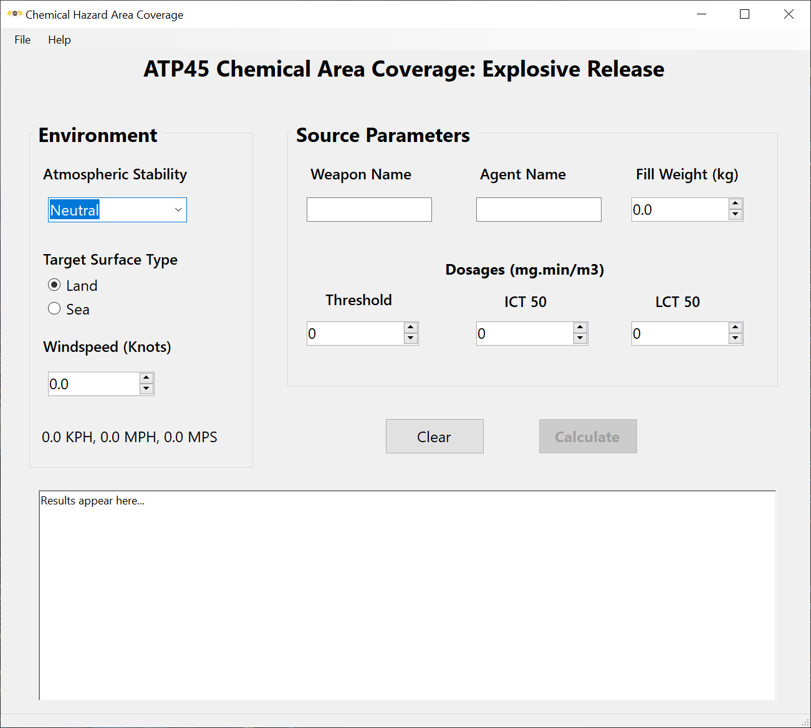
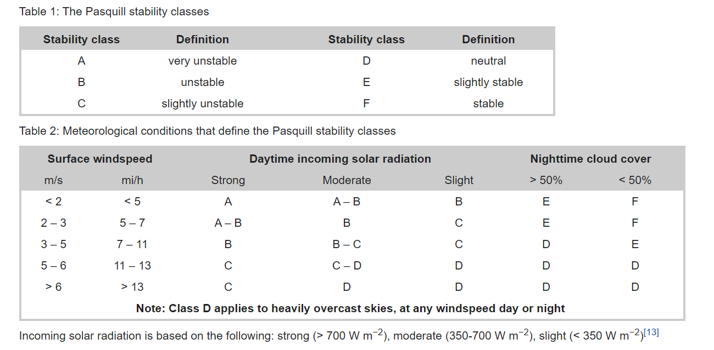
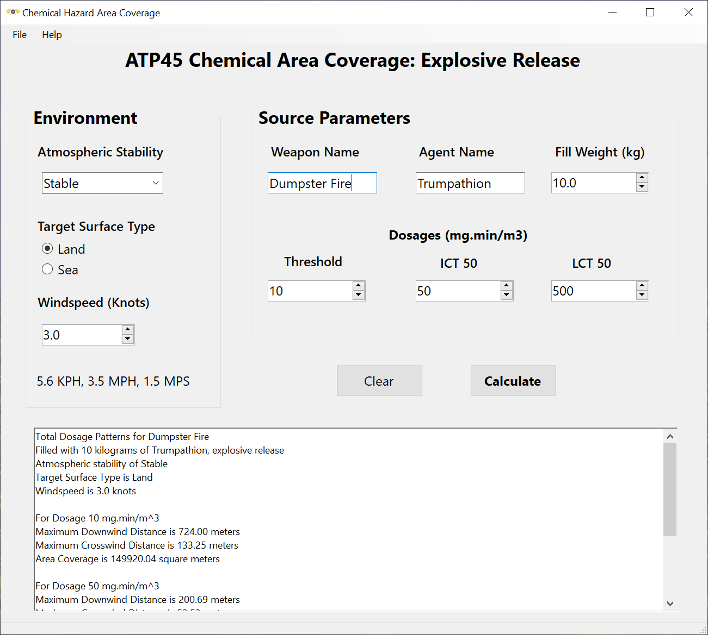
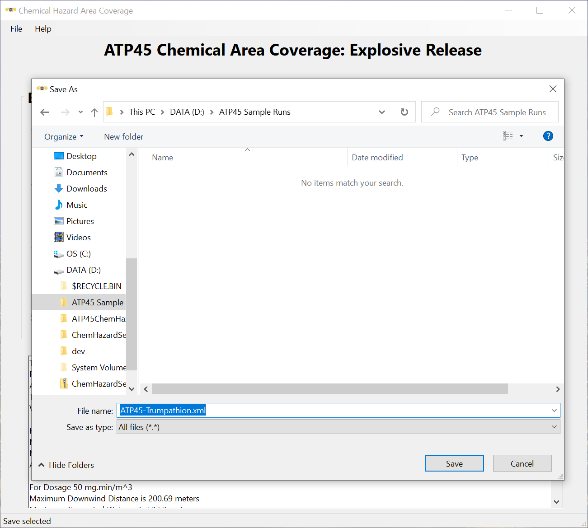
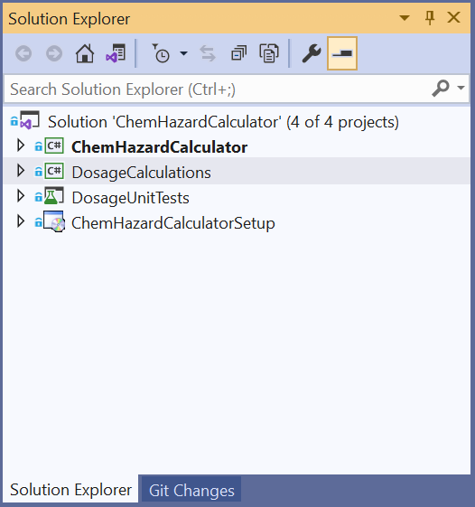

# ATP45 Chemical Hazard Calculator #

## Abstract 
One means of predicting the hazard area generated by an instantaneous (explosive) vapor or aerosol release of a toxic chemical is to mathematically model the resulting cloud as a 3-dimensional normal distribution evolving over time, otherwise known as a [gaussian plume model](https://en.wikipedia.org/wiki/Atmospheric_dispersion_modeling).

The model implemented here was developed in 1987 by the Canadian Defence Research Establishment Suffield, Ralston, Alberta as the standard NATO Allied Technical Publication ATP-45 algorithm for calculating chemical hazards.  From this algorithm, a computer program in Microsoft FORTRAN 4.1 was written by Mr. Stanley B. Mellsen of DRE Suffield for computation of chemical hazards.  The Suffield algorithm has roots in the seminal transport and diffusion work of [Sutton](https://en.wikipedia.org/wiki/Graham_Sutton), Calder, [Pasquill](https://en.wikipedia.org/wiki/Frank_Pasquill), and many others in the 1940-1970s.

In this project, we have converted the FORTRAN code to more modern Microsoft C#, and have validated the code with unit tests described by criteria in Suffield Memorandum No. 1275, Appendix A. *That document and its accompanying FORTRAN code was approved for unlimited public release on November 30, 1989, by the United States Defense Technical Information Center.*  A PDF copy of the Suffield Memorandum may be found in the Documents folder of this repository.

## The Application
With this effort, we have converted the Suffield FORTRAN Dosage algorithm to C# and validated its output through unit testing.  We have designed a user interface with the Microsoft Windows Forms framework to build a simple Chemical Hazard Area calculator that uses this algorithm as the baseline for calculating maximum downwind, crosswind, and area coverage values for three simultaneous total dosage values of interest.


*ATP45 Chemical Area Coverage Calculator*

## Model Inputs - Environment Parameters
We have three main environmental inputs. The first of these is the **Atmospheric Stability** at the release location. The choices in the combo box reflect the **Pasquill Stability Category**, the oldest and most commonly used method of categorizing atmospheric turbulence at the time of release. The tables below show meterological conditions that define the Pasquill stability enumeration:


*Pasquill Stability Category Estimation*

The second input is the **Target Surface Type**, Land or Sea, at the place of release.  Selection of this input affects velocity of agent depostion and other internal model parameters.

The third input is the **Windspeed** at the time and place of release, in nautical miles per hour.  This value is entered using the NumericUpDown box, either by clicking on the up/down arrows or by entering a value in the box.  When a value is entered, it is converted to miles per hour, kilometers per hour, and meters per second and displayed below the input box.

## Model Inputs - Source Parmeters
Source parmeters include the weapon or device name, the agent name, the agent fill weight of the munition or device in kilograms, and total dosage values in mg.min/m^3 for three toxicity levels of interest.

Typical dosage levels of interest are:

 * *Threshold*, where a normal person might first feel detectable effects of the agent;
 * *ICT50*, or Incapacitating Dosage, where 50% of exposed personnel will be rendered ineffective after 2 minutes of exposure; 
 * *LCT50*, or Lethal Dosage, where 50% of exposed personnel will die after two minutes of exposure at this level.

 Really, these levels can represent whatever your criteria of interest happen to be, with the limitation that the Threshold dose be less than ICT50, which must be less than LCT50, and all must be greater than zero.

Toxicity levels for this application are measured in mg-min/m^3, but in the case of many industrial chemicals, toxicity levels of interest are only available in Parts Per Million form (PPM).  The National Institute for Occupational Safety and Health has built a [conversion calculator](https://www.cdc.gov/niosh/docs/2004-101/calc.html) to convert PPM measurements to mg-min/m^3 and vise-versa. 

## Model Results

Let's do an example run.  We'll use a notional dummy chemical agent called **Trumpathion** to illustrate the software's features.  Consider the inputs below:


*ATP45 Chemical Area Coverage Calculator after run*

Note that we've chosen a fill weight of 10kg, with Threshold, ICT50, and LCT50 dosages of 10, 50, and 500 mg-min/m^3, Stable atmospheric conditions on Land, with a windspeed of 3 knots.  When we enter the inputs, the Calculate button will be enabled and when pressed, the results will appear in the text box below.  For this notional sample run, the output is:

```
Total Dosage Patterns for Dumpster Fire
Filled with 10 kilograms of Trumpathion, explosive release
Atmospheric stability of Stable
Target Surface Type is Land
Windspeed is 3.0 knots

For Dosage 10 mg.min/m^3
Maximum Downwind Distance is 724.00 meters
Maximum Crosswind Distance is 133.25 meters
Area Coverage is 149920.04 square meters

For Dosage 50 mg.min/m^3
Maximum Downwind Distance is 200.69 meters
Maximum Crosswind Distance is 53.53 meters
Area Coverage is 16753.85 square meters

For Dosage 500 mg.min/m^3
Maximum Downwind Distance is 27.74 meters
Maximum Crosswind Distance is 13.84 meters
Area Coverage is 602.17 square meters
```
This data alone is sufficient for many types of analyses, but we might want the shape of the patterns for plotting on a map.  The ATP45 Chemical Area Coverage Calculator will save the results as XML, including the patterns, through the File|Save menu.  Once a run has been made, select File|Save and enter a filename for your data.


*Results - File Save Dialog*

Let's take a look at the XML from the above sample run.  In the next listing, we've collapsed the Calculated Pattern DosageField nodes to show you just the inputs for the run.
```xml
<ChemHazardViewModel xmlns="http://schemas.datacontract.org/2004/07/ChemHazardCalculator" xmlns:i="http://www.w3.org/2001/XMLSchema-instance">
    <AgentName>Trumpathion</AgentName>
    <CalculatedPattern xmlns:a="http://schemas.datacontract.org/2004/07/AdvancedATP45.ChemHazard">
        <a:AgentName>Trumpathion</a:AgentName>
        <a:Patterns>
            <a:DosageField>
            ...
            </a:DosageField>
            <a:DosageField>
            ...
            </a:DosageField>
            <a:DosageField>
            ...
            </a:DosageField>
        </a:Patterns>
        <a:Psc>Stable</a:Psc>
        <a:Qkg>10</a:Qkg>
        <a:Tolerance>0.02</a:Tolerance>
        <a:Tst>Land</a:Tst>
        <a:UKts>3</a:UKts>
        <a:WeaponName>Dumpster Fire</a:WeaponName>
    </CalculatedPattern>
    <ICT50Dosage>50</ICT50Dosage>
    <LCT50Dosage>500</LCT50Dosage>
    <Psc>Stable</Psc>
    <Qkg>10</Qkg>
    <ThresholdDosage>10</ThresholdDosage>
    <Tst>Land</Tst>
    <UKts>3</UKts>
    <WeaponName>Dumpster Fire</WeaponName>
</ChemHazardViewModel>
```
Each DosageField element contains an AreaCoverageSquareMeters node, follwed by 30 dosage value nodes and the other values, like this:
```xml
<a:DosageField>
    <a:AreaCovergeSquareMeters>149920.0375</a:AreaCovergeSquareMeters>
    <a:DosageValues>
        <a:DosageValue>
            <a:Dosage>10.006017767862227</a:Dosage>
            <a:XMeters>24.133333333333333</a:XMeters>
            <a:YMeters>45.640625</a:YMeters>
        </a:DosageValue>
        <a:DosageValue>
            <a:Dosage>9.98914440171314</a:Dosage>
            <a:XMeters>48.266666666666666</a:XMeters>
            <a:YMeters>65.125</a:YMeters>
        </a:DosageValue>
    ...
    </a:DosageValues>
    <a:MaxCrosswindDistance>133.25</a:MaxCrosswindDistance>
    <a:MaxDownwindDistance>724</a:MaxDownwindDistance>
    <a:Threshold>10</a:Threshold>
</a:DosageField>
```
This sample file is included in the Documents folder of this repository.

A future version of the [ATP45 Nuclear Fallout Calculator](https://www.atp45.com) will contain plotting from chemical munitions using this software.  

Note that the YMeters distance of each dosage value represents only one side of the cloud from along centerline, you must plot both sides for a correct visual representation.

You can also load this XML file from the File|Open menu, change parameters as desired, and press Calculate again for a different result, which you then may save again, and so forth.

## Area Coverage Methodology
The implemented ATP45 Dosage algorithm finds the total dosage at X and Y coordinates in meters from a release of Q kilograms of agent at a windspeed of U knots, with a Target Surface Type of Land or Sea, and Atmospheric Stablity defined in the Pasquill Stability Category.

This is the root of what we need to calculate the area covered by a release to a particular level of toxicity.

First, we find the total X distance downwind of the release for the dosage of interest using [numerical bisection](https://en.wikipedia.org/wiki/Bisection_method) to a particular tolerance level (.02 mg-min/m^3).  We then divide this distance by 30 and proceed downwind from the release point at each slice distance to calculate the maximum crosswind distance at each point X, also using numerical bisection, to the tolerance.

It is then a simple matter to add the areas of the slice rectangles times 2 (one for each side of the cloud) to get an accurate approximation of the area coverage of the release, and to save the wind coordinates of each slice for eventual plotting.

If you wish to plot these coordinates on a map, remember that they are in *wind coordinates* that must be [rotated](https://en.wikipedia.org/wiki/Rotation_of_axes) to the wind direction in whatever coordinate system your map uses.

## Visual Studio Solution
The Visual Studio solution is shown below. There are four projects:



*Visual Studio Solution Explorer*

The `ChemHazardCalculator` project is first in the list, and is the main project for the Windows Forms application and interface.  In the repository, this folder also contains the Visual Studio Solution file for the entire set of projects.

The `DosageCalculations` project is where the main Dosage routines are stored.  This is a separate library project to facilitate unit testing.

The `DosageUnitTests` project is where the Dosage algorithm unit tests are stored.  Tests are run with the [Microsoft Test Explorer](https://docs.microsoft.com/en-us/visualstudio/test/run-unit-tests-with-test-explorer?view=vs-2019) and NUnit testing framework.

The `ChemHazardCalculatorSetup` project prepares a standard Windows Installer and Setup program with the output of the other projects.

For your convenience, a Release version of the ATP45 Chemical Area Coverage Calculator is made available from this repository in the Release section.

If you wish to build the calculator from the project files, you will need Microsoft [Visual Studio Community Edition 2019](https://visualstudio.microsoft.com/downloads/), available free from Microsoft.

## About the Author
The author is a former Chemical Corps officer of the United States Army and was assigned as an Operations Research Officer in the Concepts & Studies Division, Combat Developments Directorate, United States Army Chemical School. She was a full-time software engineer at Microsoft in the Core Operating Systems Division (Windows). She now writes software in the Seattle area.

## Privacy Policy
No personally identifiable information is collected, transmitted or stored by this application.

## License
  
Copyright (c) 2021 by Paula Scholz. All rights reserved.

MIT License

Permission is hereby granted, free of charge, to any person obtaining a copy
of this software and associated documentation files (the "Software"), to deal
in the Software without restriction, including without limitation the rights
to use, copy, modify, merge, publish, distribute, sublicense, and/or sell
copies of the Software, and to permit persons to whom the Software is
furnished to do so, subject to the following conditions:

The above copyright notice and this permission notice shall be included in all
copies or substantial portions of the Software.

THE SOFTWARE IS PROVIDED *AS IS*, WITHOUT WARRANTY OF ANY KIND, EXPRESS OR
IMPLIED, INCLUDING BUT NOT LIMITED TO THE WARRANTIES OF MERCHANTABILITY,
FITNESS FOR A PARTICULAR PURPOSE AND NONINFRINGEMENT. IN NO EVENT SHALL THE
AUTHORS OR COPYRIGHT HOLDERS BE LIABLE FOR ANY CLAIM, DAMAGES OR OTHER
LIABILITY, WHETHER IN AN ACTION OF CONTRACT, TORT OR OTHERWISE, ARISING FROM,
OUT OF OR IN CONNECTION WITH THE SOFTWARE OR THE USE OR OTHER DEALINGS IN THE
SOFTWARE.
